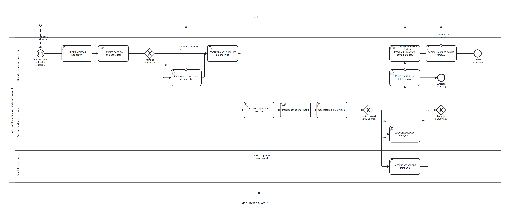
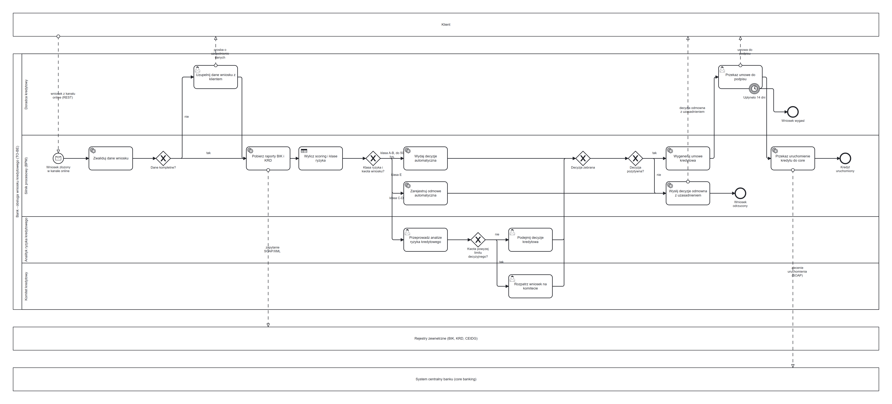

# Proces KRD-001: obsługa wniosku kredytowego

Modelowanie i dokumentacja procesu bankowego z obszaru ryzyka kredytowego.
Dwa stany: obecny (AS-IS) i docelowy (TO-BE, prowadzony przez silnik workflow).

## Stan obecny (AS-IS)

Papier, arkusz kalkulacyjny, poczta e-mail. Każdy wniosek - niezależnie od kwoty
i ryzyka - przechodzi tę samą drogę przez człowieka.

## Stan docelowy (TO-BE)

Proces prowadzony przez silnik BPM: walidacja i pobranie raportów jako zadania
usługowe, scoring jako zadanie reguł biznesowych, decyzja automatyczna dla wniosków
o niskim ryzyku i małej kwocie, analiza ręczna tam, gdzie potrzebny jest osąd.

## Dokumentacja

1. [Karta procesu](dokumentacja/01-karta-procesu.md) - granice, właściciel, problemy AS-IS
2. [Role i macierz RACI](dokumentacja/02-role-i-raci.md) - kto wykonuje, kto odpowiada, limity decyzyjne
3. [Katalog zadań i reguł](dokumentacja/03-katalog-zadan-i-regul.md) - każde zadanie z typem, wykonawcą i SLA; warunki na bramkach
4. [Specyfikacja integracji](dokumentacja/04-integracje.md) - SOAP, REST, przykładowe XML, XSD, obsługa błędów
5. [Model danych](dokumentacja/05-model-danych.sql) - tabele, ograniczenia, zapytania raportowe
6. [Mierniki i efekty](dokumentacja/06-mierniki-i-efekty.md) - co mierzymy, czego zmiana nie poprawi, ryzyka
7. [Uruchomienie w Camunda 8](dokumentacja/07-uruchomienie-camunda.md) - warstwa wykonawcza, workery, trzy przebiegi testowe

## Trzy decyzje projektowe, których nie widać z samego diagramu

1. **Automatyzujemy skrajne klasy ryzyka, nie środek.** Decyzja automatyczna obejmuje
   klasy A-B do 50 000 zł i odmowę dla klasy E. Wnioski klasy C-D nadal ocenia analityk,
   bo tam wynik zależy od osądu, a nie od progu punktowego.

2. **Warunki na bramce muszą się wykluczać i mieć ustaloną kolejność.** Najpierw klasa E,
   potem próg automatyczny, na końcu ścieżka domyślna. Bez tego wniosek klasy E na małą
   kwotę spełnia dwa warunki naraz, a wynik zależy od implementacji silnika.

3. **Termin ważności decyzji to zdarzenie brzegowe, nie pole w bazie.** Po 14 dniach
   sprawa kończy się sama, a zadanie znika z listy doradcy. Data w bazie wymagałaby
   procesu, który ją sprawdza - czyli drugiego procesu pilnującego pierwszego.

## Pliki źródłowe

| Plik | Opis |
|---|---|
| `diagramy/wniosek-kredytowy-AS-IS.bpmn` | model stanu obecnego, BPMN 2.0 |
| `diagramy/wniosek-kredytowy-TO-BE.bpmn` | model stanu docelowego, BPMN 2.0 |
| `diagramy/wniosek-kredytowy-TO-BE-camunda.bpmn` | ten sam przebieg z warstwą wykonawczą Zeebe |
| `diagramy/*.png` | podglądy renderowane z plików `.bpmn` |
| `diagramy/uruchomienie/` | zrzuty z Camunda Operate po wykonaniu procesu |

Modele powstają z `narzedzia/build_kredyt.py` - patrz README główne.

---
Autor: Mateusz Biernat
