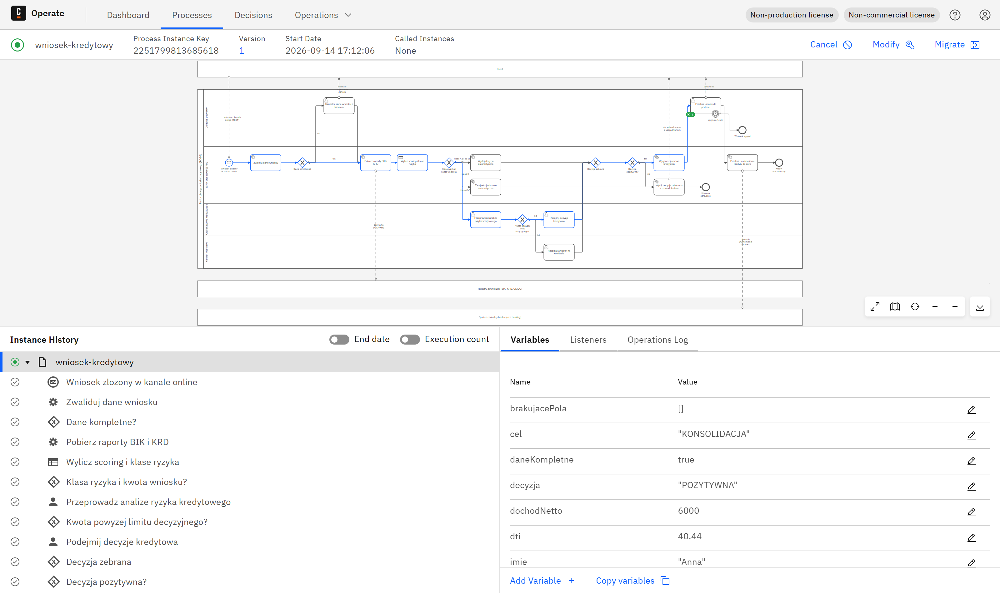

# Uruchomienie procesu w silniku Camunda 8

Model TO-BE nie jest tylko rysunkiem: ten sam przebieg został wdrożony i wykonany
w silniku **Camunda 8 Run 8.9.19** (Zeebe, Operate, Tasklist), na trzech sprawach
prowadzących przez trzy różne ścieżki decyzyjne.



Powyżej: przebyta ścieżka podświetlona na modelu, historia instancji i zmienne
sprawy po zakończeniu. To jest ten sam plik BPMN, który leży w `diagramy/`.

## Dwa pliki, jeden przebieg

| Plik | Do czego |
|---|---|
| `wniosek-kredytowy-TO-BE.bpmn` | model biznesowy - do rozmowy z biznesem i do dokumentacji |
| `wniosek-kredytowy-TO-BE-camunda.bpmn` | ten sam przebieg z warstwą wykonawczą dla Zeebe |

Wariant wykonywalny **nie jest rysowany drugi raz**. Powstaje ze specyfikacji
modelu biznesowego (`narzedzia/build_kredyt_camunda.py`), która dokłada tylko to,
czego potrzebuje silnik. Dwa niezależne diagramy rozjechałyby się przy pierwszej
poprawce procesu.

## Co dokłada warstwa wykonawcza

| Element modelu | Rozszerzenie Zeebe | Wartość |
|---|---|---|
| Zadania usługowe (8) | `zeebe:taskDefinition` | typ zadania dla workera, np. `scoring-kredytowy` |
| Zadania użytkownika (5) | `zeebe:userTask` + `zeebe:assignmentDefinition` | grupy: `doradcy`, `analitycy-ryzyka`, `komitet-kredytowy` |
| Bramki wyłączne (4) | `conditionExpression` (FEEL) | warunki z katalogu reguł |
| Bramki wyłączne (4) | atrybut `default` | ścieżka domyślna dla każdej bramki |
| Zdarzenie brzegowe | `timeDuration` | `P14D` - termin ważności decyzji |
| Zdarzenie startowe | `messageRef` | komunikat `wniosek-kredytowy-zlozony` |

Warunki na bramkach w notacji FEEL, przeniesione wprost z
[katalogu reguł](03-katalog-zadan-i-regul.md):

```
Klasa ryzyka i kwota wniosku?
  -> decyzja automatyczna:  = klasaRyzyka in ("A","B") and kwota <= 50000
  -> odmowa automatyczna:   = klasaRyzyka = "E"
  -> analiza ręczna:        ścieżka domyślna

Kwota powyżej limitu decyzyjnego?
  -> komitet kredytowy:     = kwota > 100000
  -> analityk:              ścieżka domyślna
```

**Każda bramka rozgałęziająca ma ścieżkę domyślną** i skrypt budujący to sprawdza,
zanim zapisze plik. Bramka bez domyślnej ścieżki zatrzymuje instancję w miejscu
w chwili, gdy żaden warunek nie jest spełniony - a to zdarza się na produkcji,
nie w czasie modelowania.

## Workery

Zadania usługowe obsługuje `narzedzia/camunda_kredyt.py` przez **REST API v2**
silnika - bez gRPC i bez dodatkowych bibliotek. Osiem typów zadań:

| Typ zadania | Co robi zaślepka |
|---|---|
| `walidacja-wniosku` | sprawdza pola wymagane i zgodę BIK, ustawia `daneKompletne` |
| `pobranie-raportow` | zwraca raport zależny od PESEL (ta sama sprawa - ten sam wynik) |
| `scoring-kredytowy` | liczy DTI, punktację 0-100 i klasę ryzyka A-E |
| `decyzja-automatyczna` | decyzja pozytywna z uzasadnieniem |
| `odmowa-automatyczna` | decyzja negatywna z powodem z reguł |
| `generowanie-umowy` | numer umowy i oprocentowanie |
| `powiadomienie-klienta` | potwierdzenie wysyłki |
| `uruchomienie-kredytu` | potwierdzenie z systemu centralnego |

Zaślepka rejestru jest **deterministyczna**, nie losowa: wynik zależy od PESEL,
więc powtórzony przebieg tej samej sprawy daje ten sam raport. Losowanie
uniemożliwiałoby porównanie dwóch przebiegów, a to jedyne, po co uruchamia się
proces w trybie testowym.

## Przebiegi testowe

Trzy sprawy, trzy różne ścieżki - dokładnie te, które opisuje katalog reguł:

| Sprawa | Dane wejściowe | Wynik scoringu | Ścieżka | Stan końcowy |
|---|---|---|---|---|
| A | 45 000 zł, dochód 7 800 zł, staż 26 mies. | 100 pkt, klasa A, DTI 22,92% | decyzja automatyczna | kredyt uruchomiony |
| B | 60 000 zł, dochód 6 000 zł, staż 30 mies. | 75 pkt, klasa B, DTI 40,44% | analiza ręczna, decyzja analityka | oczekuje na podpis umowy |
| C | 200 000 zł, dochód 3 200 zł, staż 8 mies. | 53 pkt, klasa D, DTI 211,42% | analiza ręczna, komitet | wniosek odrzucony |

Sprawa B jest tu najciekawsza: **klasa ryzyka B, a mimo to analiza ręczna** -
bo warunek decyzji automatycznej wymaga jednocześnie dobrej klasy i kwoty do
50 000 zł. Sprawa na 60 000 zł wypada ścieżką domyślną. Gdyby warunek sprawdzał
tylko klasę, bank oddałby decyzję o 60 000 zł regule punktowej.

## Jak to powtórzyć

```bash
# 1. Silnik (Camunda 8 Run, wymaga Javy 21+)
./c8run start                     # Operate: http://localhost:8080/operate

# 2. Wdrożenie modelu
python narzedzia/camunda_kredyt.py deploy

# 3. Nowa sprawa (publikacja komunikatu startowego)
python narzedzia/camunda_kredyt.py start
python narzedzia/camunda_kredyt.py start '{"kwota":200000,"dochodNetto":3200}'

# 4. Obsługa zadań usługowych
python narzedzia/camunda_kredyt.py worker

# 5. Zadania ludzi
python narzedzia/camunda_kredyt.py zadania
python narzedzia/camunda_kredyt.py zakoncz <klucz> '{"decyzja":"POZYTYWNA"}'
```

Logowanie do Operate i Tasklist: `demo` / `demo`.

## Czego ta konfiguracja nie ma

1. **Reguł scoringowych jako tabeli decyzyjnej DMN.** Scoring liczy worker, a nie
   silnik reguł. W docelowym rozwiązaniu tabela DMN pozwala zmienić progi bez
   wdrażania nowej wersji procesu - i o to samo chodzi w uwadze o wersjonowaniu
   modelu w [katalogu reguł](03-katalog-zadan-i-regul.md).
2. **Formularzy zadań.** Zadania użytkownika mają grupy odbiorców, ale nie mają
   formularzy - decyzje wchodzą zmiennymi przez API.
3. **Prawdziwych integracji.** Workery to zaślepki; kontrakty SOAP i REST stoją
   w [specyfikacji integracji](04-integracje.md).

---
Autor: Mateusz Biernat
