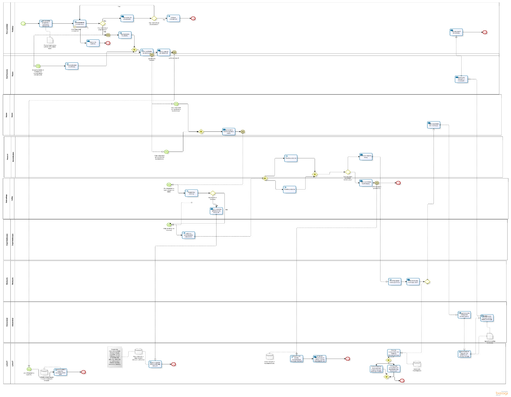
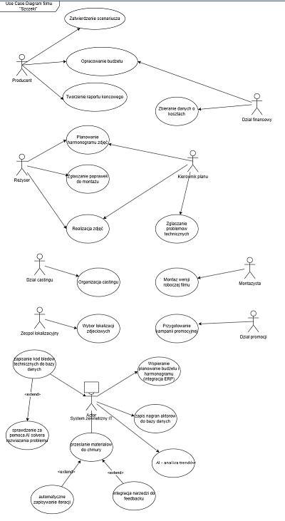

# Produkcja filmu fabularnego - analiza procesu (projekt akademicki)

Analiza i modelowanie procesu produkcji filmu fabularnego: stan obecny, stan docelowy
ze wsparciem IT oraz diagramy UML opisujące zakres funkcjonalny systemu.
Projekt zaliczeniowy, PJATK.

Pełny opis: [dokumentacja/01-dokumentacja-procesu.md](dokumentacja/01-dokumentacja-procesu.md)

## Model docelowy (BPMN 2.0, Bizagi Modeler)

9 uczestników, bramki XOR i AND, zdarzenia komunikatu między pulami, magazyny danych,
podproces realizacji zdjęć.

## Zakres funkcjonalny (UML, diagram przypadków użycia)

Rozszerzenia `<<extend>>` odpowiadają usprawnieniom wprowadzonym w modelu TO-BE:
integracja z ERP, baza nagrań castingowych, rejestr błędów, moduł AI, chmura,
narzędzie do zbierania uwag, analiza trendów.

## Zawartość katalogu

| Ścieżka | Co tam jest |
|---|---|
| `zrodla-oryginal/` | pliki w stanie oryginalnym - **nic tu nie jest zmieniane**; katalog zostaje lokalnie i nie trafia do repozytorium |
| `poprawione/produkcja-filmu-TO-BE.bpm` | model po korekcie etykiet i metadanych |
| `dokumentacja/01-dokumentacja-procesu.md` | karta procesu, problemy AS-IS, usprawnienia TO-BE, ograniczenia zakresu |
| `dokumentacja/raport-zmian-etykiet.md` | 62 zmiany etykiet, każda z powodem |
| `dokumentacja/obrazy/` | diagramy wyeksportowane z dokumentacji projektu |

Korektę wykonuje skrypt `narzedzia/popraw_szczeki.py`, który czyta oryginał i zapisuje
kopię. Oryginał i kopia leżą obok siebie, więc każdą zmianę da się sprawdzić.

---
Autor: Mateusz Biernat
