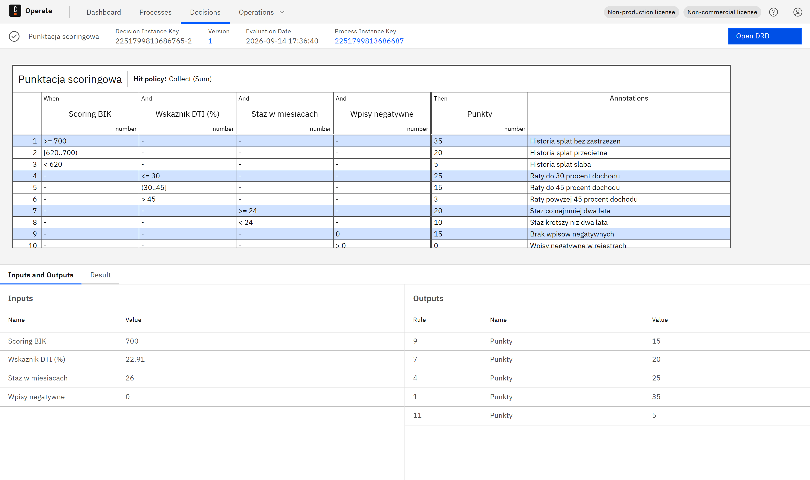

# Portfolio: modelowanie i dokumentowanie procesów biznesowych

**Mateusz Biernat** - inżynier informatyki (PJATK), modelowanie procesów w BPMN 2.0
i UML, dokumentacja procesowa i techniczna, Java / SQL / REST / SOAP / XML.

Repozytorium zawiera dwa kompletne projekty procesowe: analizę stanu obecnego,
model stanu docelowego i dokumentację, na podstawie której da się taki proces
skonfigurować w silniku workflow.

## Projekty

### 1. Obsługa wniosku kredytowego (`01-proces-kredytowy/`)

Proces bankowy z obszaru **ryzyka kredytowego**: od złożenia wniosku do uruchomienia
kredytu. Dwa modele BPMN (AS-IS i TO-BE) plus pełna dokumentacja wdrożeniowa.

| Dokument | Zawiera |
|---|---|
| [Karta procesu](01-proces-kredytowy/dokumentacja/01-karta-procesu.md) | właściciel, wyzwalacz, granice, 8 problemów stanu obecnego |
| [Role i RACI](01-proces-kredytowy/dokumentacja/02-role-i-raci.md) | 7 ról, macierz odpowiedzialności, limity decyzyjne |
| [Katalog zadań i reguł](01-proces-kredytowy/dokumentacja/03-katalog-zadan-i-regul.md) | 13 zadań z SLA, 4 bramki z warunkami, reguły scoringowe |
| [Integracje](01-proces-kredytowy/dokumentacja/04-integracje.md) | kontrakty SOAP i REST, przykładowe komunikaty XML, fragment XSD, obsługa błędów |
| [Model danych](01-proces-kredytowy/dokumentacja/05-model-danych.sql) | 7 tabel SQL, ograniczenia, indeksy, 5 zapytań raportowych |
| [Mierniki i efekty](01-proces-kredytowy/dokumentacja/06-mierniki-i-efekty.md) | 7 mierników, porównanie AS-IS i TO-BE, ryzyka wdrożenia |
| [Uruchomienie w Camunda 8](01-proces-kredytowy/dokumentacja/07-uruchomienie-camunda.md) | wdrożenie modelu w silniku, workery po REST API, trzy przebiegi testowe |
| [Tabele decyzyjne DMN](01-proces-kredytowy/dokumentacja/08-tabele-decyzyjne-dmn.md) | model scoringowy w DMN 1.3, polityki trafień, wywołanie z procesu |

Stan docelowy:


**Model jest wykonywalny.** Wdrożyłem go w Camunda 8 Run i przepuściłem sprawy
przez trzy różne ścieżki decyzyjne. Scoring liczą tabele decyzyjne DMN wywoływane
przez silnik reguł - poniżej instancja procesu w Operate z podświetloną przebytą
drogą, historią i zmiennymi:


Ta sama sprawa od strony reguł - tabela scoringowa z podświetlonymi regułami,
które zadziałały, oraz ich wkładem punktowym:



### 2. Produkcja filmu fabularnego (`02-produkcja-filmu/`)

Projekt akademicki (PJATK): analiza procesu produkcji filmu, modele AS-IS i TO-BE
w Bizagi Modeler, diagramy UML przypadków użycia i diagram analityczny w draw.io
oraz Lucidchart, lista usprawnień z uzasadnieniem biznesowym.

Katalog zawiera **oryginał bez zmian**, poprawioną kopię modelu i
[raport zmian](02-produkcja-filmu/dokumentacja/raport-zmian-etykiet.md) - 62 etykiety,
każda z powodem korekty. Szczegóły w
[dokumentacji procesu](02-produkcja-filmu/dokumentacja/01-dokumentacja-procesu.md).

## Jak to zrobione

Diagramy procesu kredytowego **nie są rysowane ręcznie**. Powstają ze specyfikacji
w kodzie, a układ (kolumny, tory, punkty załamania krawędzi) liczy generator:

```
narzedzia/gen_bpmn.py        generator BPMN 2.0 + BPMN DI ze specyfikacji
narzedzia/build_kredyt.py    specyfikacja obu modeli procesu kredytowego
narzedzia/render_bpmn.py     render .bpmn do PNG przez bpmn-js w Chromium
narzedzia/popraw_szczeki.py  korekta etykiet w modelu Bizagi (XPDL w archiwum .bpm)
narzedzia/build_kredyt_camunda.py  wariant wykonywalny dla Camunda 8 (Zeebe)
narzedzia/camunda_kredyt.py  wdrozenie (BPMN + DMN), start sprawy i workery po REST API v2
narzedzia/pdf_dokumentacja.py  skladanie dokumentacji do PDF
narzedzia/zrzut_operate.py   zrzuty z Operate jako dowod uruchomienia
```

Powód jest praktyczny: poprawka jednego zadania nie wymaga przesuwania reszty figur,
a podgląd PNG powstaje z tego samego pliku co model, więc nigdy się z nim nie rozjedzie.
Generator ma też kontrolę spójności (`sanity`) - zadanie bez wejścia albo przepływ
do nieistniejącego elementu zatrzymuje budowanie, zamiast trafić do pliku.

### Uruchomienie

```bash
pip install playwright
python -m playwright install chromium

python narzedzia/build_kredyt.py    # generuje oba pliki .bpmn
python narzedzia/render_bpmn.py     # renderuje wszystkie .bpmn do .png
python narzedzia/popraw_szczeki.py  # tworzy poprawioną kopię modelu Bizagi + raport
```

Pliki `.bpmn` otwierają się w [bpmn.io](https://demo.bpmn.io), Camunda Modeler
i importują do Bizagi Modeler. Plik `.bpm` otwiera Bizagi Modeler.

## Notacje i narzędzia

| Obszar | Czego używam |
|---|---|
| Modelowanie procesów | BPMN 2.0 (pule, tory, bramki XOR i AND, zdarzenia komunikatu i czasu, zadania usługowe i reguł biznesowych) |
| Reguły decyzyjne | DMN 1.3 (tabele decyzyjne, polityki trafień COLLECT SUM i FIRST, wyrażenia FEEL) |
| Analiza | UML: przypadki użycia, diagram klas, diagram analityczny |
| Narzędzia | Bizagi Modeler, draw.io, Lucidchart, bpmn.io, Camunda Modeler |
| Dokumentacja | karta procesu, RACI, katalog zadań i reguł, specyfikacja integracji, mierniki |
| Technicznie | Java, SQL, REST, SOAP, XML/XSD, Python |
